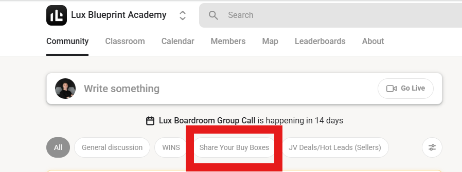
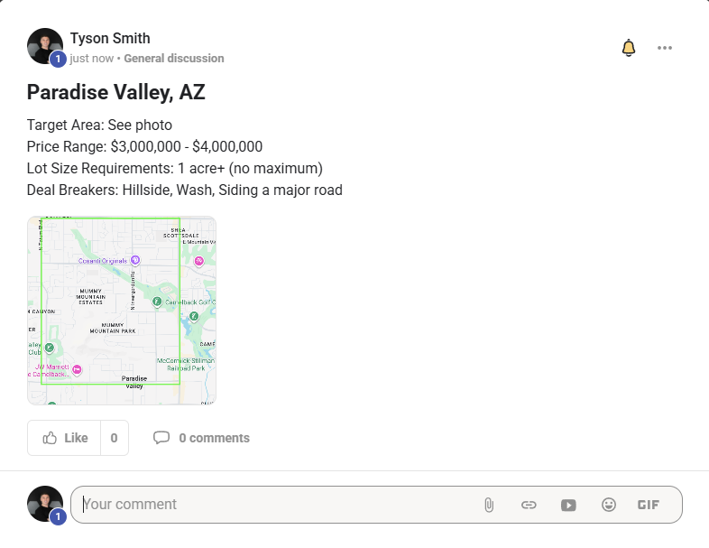
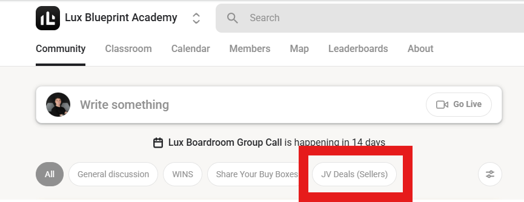
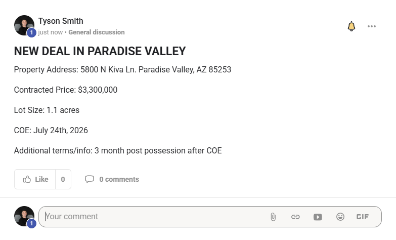

# How to JV Inside The Community

[Original Skool lesson](https://www.skool.com/lux-blueprint-academy-9786/classroom/576c5cbc?md=3eab21afc4e64d04aa3ba39380463aac)

Duration: 5:53. Transcript source: Native Skool English captions.

## Lesson text

Honesty & Integrity: A core value of the Lux Blueprint community is honesty and integrity. We are honest with one another and we operate from an abundance mindset when it comes to these deals. Poaching deals, contacting another member's lead, stealing information, or any similar behavior toward fellow students will not be tolerated and will result in immediate termination from the group.

Inside Lux Blueprint Academy, there are 3 ways you can Joint Venture

1) JV With Tyson and Matthew

In order to JV with Tyson and Matthew you can submit deals/hot leads that are inside their [Approved Buy Boxes](https://www.skool.com/lux-blueprint-academy-9786/classroom/576c5cbc?md=072d1f4d1a414c7aab36791c4475c4b9&utm_campaign=skool_link_classroom&utm_content=5640a423877f48ba81b0a18bd5dfec58) using the page down below titled "JV With Tyson and Matthew".

2) Share Your Buy Boxes with the Community

You can share your developers' buy boxes by submitting them in the "Share Your Buy Boxes" tab in the Community.

Here you will upload the information about what your developer is looking for, so other students in the community can go search for deals for your developer.

ALL BUY BOXES YOU UPLOAD HERE MUST FOLLOW THIS SPECIFIC TEMPLATE:

Title: [City], [State]

Target Area  A screenshot of the map with clear boundaries drawn, or the specific zip code(s).

Price Range  The amount the developer is looking to pay.

Lot Size Requirements Minimum and maximum acceptable lot size.

Deal Breakers  Anything that kills the deal (e.g., washes, flood zones, easements, etc.).

For example, a correctly submitted Buy Box could look like this:

Now, other members of the community can go target properties that meet your developers criteria, and once they get them under contract, you can JV the deal together.

Note: make sure to execute a JV Agreement with the other member prior to sending out any assignment contracts to your Buyer.

3) Post Your Deals

Alternatively, when you get a deal under contract you can post it under the "JV Deals (Sellers)" tab in the Community.

Here you will post the details of your deal under contract, so other students can help you go find a buyer.

ALL JV DEALS YOU UPLOAD MUST FOLLOW THIS SPECIFIC TEMPLATE:

Title: NEW DEAL IN [CITY]

Property Location: (DO NOT POST THE EXACT ADDRESS, ONLY GIVE IT TO PEOPLE YOU HAVE TALKED TO AND YOU HAVE VERIFIED THEY ACTUALLY HAVE BUYERS IN THE AREA)

Contract Price:

Lot Size:

COE:

Additional terms/info:

For example, a correctly submitted JV Deal could look like this:

Now if any members of the community have a Buyer who may be interested in your deal, they can reach out to you to see about JVing it.

NOTE: DO NOT TRY TO MARKET SOMEONE ELSES DEAL IN THE COMMUNITY UNLESS THEY HAVE EXPRESSLY GIVEN YOU PERMISSION TO DO SO. MARKETING A DEAL WITHOUT PERMISSION IS ILLEGAL.

## Resources

- [01-image.png](01-image.png)
- [02-image.png](02-image.png)
- [03-image.png](03-image.png)
- [04-image.png](04-image.png)
- [jv-community.srt](jv-community.srt)

[Separate attachment copies](../../attachments/07%20-%20Luxury%20Deal%20JV%20Portal/04%20-%20How%20to%20JV%20Inside%20The%20Community/)

## Transcript

Caption wording is preserved. Recognition errors may be present; the transcript has not been independently verified against audio.

[0:00] What's going on everybody, Tyson Smith here, and Matthew and I are so excited

[0:04] to announce

[0:05] that we have decided to democratize the JV system within the community.

[0:11] And what that means for you is previously, we really only have the option for

[0:13] people

[0:14] to JV with Matthew and I, however, we've realized that you guys are doing such

[0:19] a good

[0:19] job of getting buy boxes all across the country and we want to see more of our

[0:23] students do

[0:23] deals with each other, so here's what we've decided to set up.

[0:27] Number one, you're still going to have the option to go ahead and JV with me

[0:31] and Matthew.

[0:31] The way to do that is to go here and submit deals the same way you have before.

[0:36] The only change we're doing with this is now we're only taking properties that

[0:39] are located

[0:40] in one of our approved buy boxes.

[0:43] So if you're a beginner, you're looking to get a deal or you're anybody who

[0:45] wants to

[0:46] do deals with Matthew and I, all you need to do is go on over to our approved

[0:49] buy boxes

[0:50] where we have listed off every single buy box that we have developers in and we

[0:54] can move

[0:54] deals very quickly and exactly the specifications, or the price range, lot size

[0:59] requirements

[1:00] and anything else you would need to know to be successful.

[1:03] However, with that being said, we also want to open up you guys to be able to

[1:06] share your

[1:07] buy boxes.

[1:08] So if you have a buy box of a developer, you're more than welcome to share it

[1:11] in the community

[1:12] using the share your buy boxes tab, okay?

[1:15] So all you would do is go to the community and post a deal in this tab, share

[1:20] your buy

[1:21] boxes, okay?

[1:22] The only way to do that is when you go to post, you just make sure that you

[1:24] select the category

[1:25] as share your buy boxes, all right?

[1:28] Now when you're submitting your buy boxes, this is, you know, your buyers are

[1:32] your buyers.

[1:33] So you're not going to be actually submitting who your developer or who your

[1:36] custom home

[1:37] builder is, you're just going to submit exactly what it is they're looking for.

[1:41] When you go ahead and submit your buy box, you're going to follow this template

[1:44] .

[1:44] So you're going to put the title as where, you know, the city and state where

[1:47] your buy

[1:48] boxes and then the actual target area.

[1:50] So ideally you should have a photo with a boundary like we've have here.

[1:55] However, if your developer is looking in a specific zip code or perhaps a

[1:58] specific area,

[1:59] like maybe you have a developer in Bellmead Nashville or Woodland Hills, Dallas

[2:06] , you're

[2:08] fine to put that there as well.

[2:10] However, having a map with clear boundaries shown is much better.

[2:13] Then you're going to have a price range, right?

[2:15] The amount the developer is looking to pay as well as the lot size requirements

[2:18] .

[2:18] So minimum and maximum acceptable lot sizes.

[2:21] Sometimes you won't have a maximum and that's fine.

[2:24] Then you're going to want to include any sort of deal breakers.

[2:26] So anything that would kill the deal, right?

[2:27] Maybe the property zone of wash, flood zone and easement.

[2:30] Maybe your buyer doesn't want anything on the water or only wants stuff on the

[2:33] water.

[2:34] Whatever it is, just go ahead and include it in the deal breakers.

[2:37] Now, now other members of the community are going to be able to actually go

[2:40] target properties

[2:41] that meet your developer's criteria.

[2:42] And once they get them under contract, you guys are welcome to JV together.

[2:47] And special note here, you need to make sure you execute a JV agreement with

[2:50] the other

[2:51] member prior to setting out any assignment contracts to the buyer, okay?

[2:54] The JV agreement template can be found here, where you can click open.

[3:00] And this is a JV agreement that you guys can sign.

[3:02] When you're doing this, you would put your company name, the other community

[3:06] member's

[3:06] company's name, the property here.

[3:09] You can go ahead and set the splits, however you like.

[3:11] Typically, we recommend doing 50/50 as that's the most fair.

[3:15] And then you can just set up whatever the arbitration is in case there is any

[3:18] sort of

[3:18] dispute, which hopefully there wouldn't ever be.

[3:21] Go ahead and put it in your state and then you guys can both sign, okay?

[3:26] So that is the first way to go ahead and JV with other community members, right

[3:30] ?

[3:30] You post your buy boxes and other students can go ahead and find deals for you.

[3:34] Alternatively, you can just post your deals inside the community as well.

[3:39] So what if you get a deal under contract?

[3:41] You can go ahead and post it here and have other students go and try and help

[3:44] you find

[3:45] a buyer for your deal, right?

[3:47] The way you do that is you post it new deal in city where the property is, the

[3:51] contract

[3:52] price, the lot size, close of escrow, and any other additional terms or info.

[3:56] So for instance, if we had this deal, if we were looking for a buyer for it, we

[3:59] wanted

[3:59] your guys's help.

[4:00] We could post it here.

[4:01] As you can see the address of what we have under contract for, the size of it,

[4:05] close of

[4:06] escrow, and then any additional terms.

[4:09] Now, again, if any members of the community have a buyer who may be interested

[4:12] in your

[4:12] deal, they can reach out to you to see about Jay being it.

[4:16] But one thing I'm going to tell you guys right now, every single person, all

[4:20] right?

[4:21] You do not try and market somebody else's deal in the community unless they

[4:24] have expressly

[4:24] given you permission to do so.

[4:26] So if you see a deal listed inside the community, right, and you have a buyer

[4:30] for it, you need

[4:31] to reach out to that other community member and say, "Hey, I have a buyer for

[4:35] your deal.

[4:36] Am I allowed to market it to them?"

[4:39] Okay?

[4:40] Deal without permission is illegal, so do not do that, okay?

[4:44] And another note that I'm going to say is, "Look, a core value of Lux Blueprint

[4:48] Community

[4:49] is honesty and integrity.

[4:50] We are honest with another.

[4:51] We operate from an abundance mindset when it comes to these deals, poaching

[4:55] anybody's

[4:55] deals, contacting other members' lead, stealing information, or any similar

[4:59] behavior towards

[4:59] fellow students will not be tolerated, and will result in immediate termination

[5:03] from the

[5:04] group, okay?

[5:05] If we have any sign of proof that you're engaging any sort of dishonest

[5:08] behavior like

[5:09] this, we are immediately going to terminate you, and I personally will never do

[5:13] business

[5:14] with you ever again, not to mention every single person in my network will

[5:17] never do business

[5:18] with you ever again, okay?

[5:20] Do not try and mess somebody, you know, screw somebody over to make a quick

[5:23] buck.

[5:24] That is a quick way.

[5:25] Like, I don't know what you believe in, but you're, you know, that is going to

[5:28] end very

[5:28] poorly for you.

[5:30] However, back to a lighter note is, look, we get so many JV submissions.

[5:35] We get so many buy boxes, and we want you guys to all be able to take advantage

[5:38] of this

[5:38] and be able to do deals with each other.

[5:40] So this is how we're setting it up so you guys can move forward and start doing

[5:43] deals

[5:44] with each other.

[5:45] So get in there, post your buy boxes, post your deals, and let's all go make a

[5:48] bunch

[5:49] of money together.

[5:50] If you have any questions, go ahead and make a post in the community.
